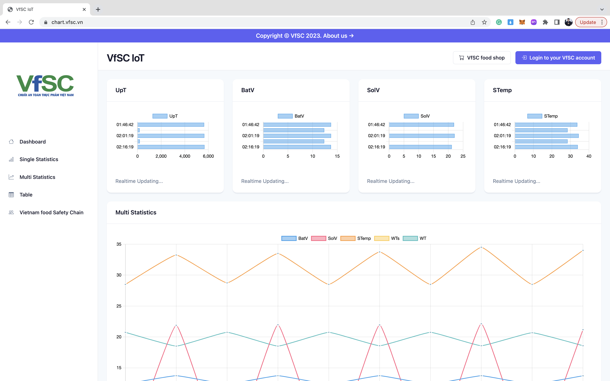
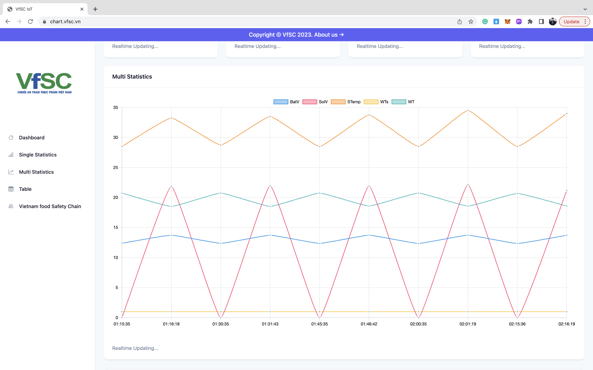
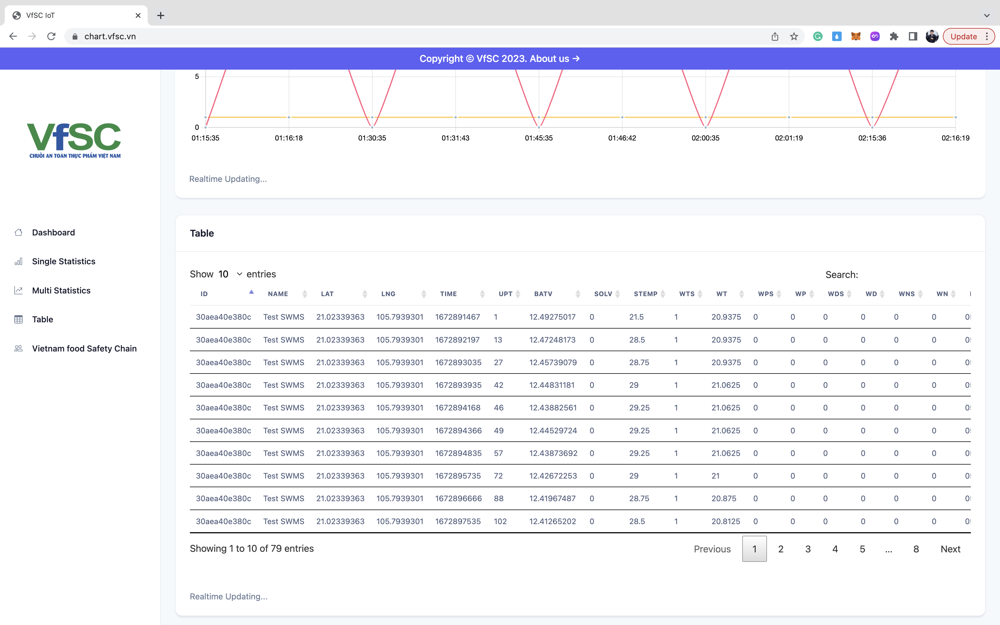

# IoT Dashboard for VfSC

[IoT Dashboard for VfSC](https://chart.vfsc.vn) is an open source realtime IoT dashboard theme for [VfSC 
Group](https://farm.vfsc.vn/).

## Preview

## What are we using?

* [Chart.js](https://www.chartjs.org/) - Open source HTML5 Charts for project.
* [DataTables](https://datatables.net/) -  Plug-in for the jQuery Javascript library.
* [Socket.IO](https://socket.io/) - Bidirectional and low-latency communication for every platform.
* [Bootstrap](https://getbootstrap.com/) - Powerful, extensible, and feature-packed frontend toolkit.

## Features

* Update data realtime.
* Generate line chart.
* Generate data table.

## Download and Installation

To begin using this template, choose one of the following options to get started:

* Clone the repo: `git clone https://github.com/minhtran241/vfsc-iot-dashboard.git`
* [Fork, Clone, or Download on GitHub](https://github.com/minhtran241/vfsc-iot-dashboard)

## Usage

After installation, run `yarn install` and then run `yarn dev` which will open up a preview of the template in your default browser, watch for changes to core template files, and live reload the browser when changes are saved.

## Bugs and Issues

Have a bug or an issue with this template? [Open a new issue](https://github.com/minhtran241/vfsc-iot-dashboard/issues) here on 
GitHub.

## Copyright and License

Code released under the [MIT](https://github.com/minhtran241/vfsc-iot-dashboard/blob/main/LICENSE) license.
